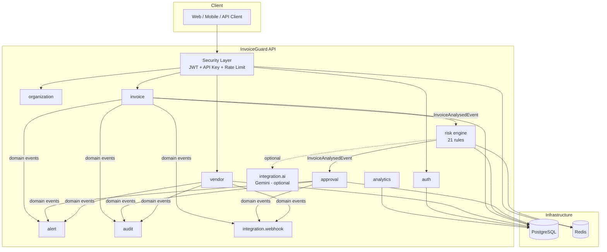
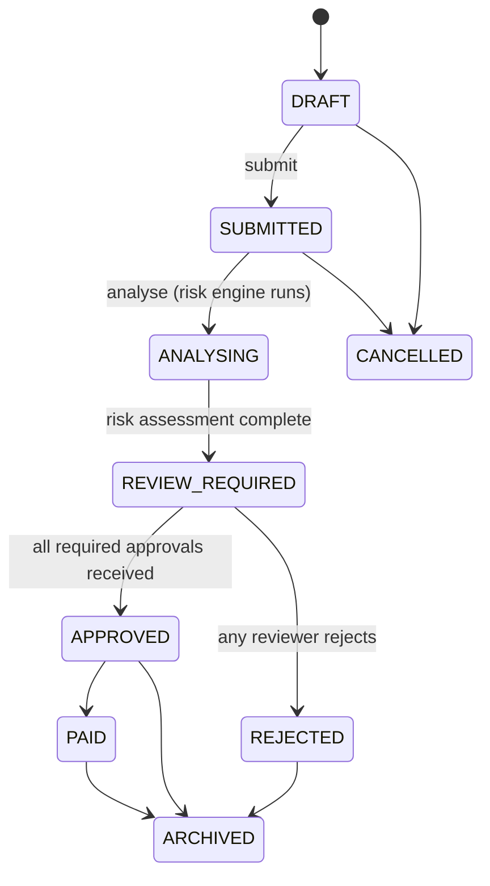

# InvoiceGuard API

**A secure, multi-tenant invoice-risk analysis platform** that detects duplicate invoices, suspicious vendor activity, altered bank details, unusual amounts, tax mismatches, missing purchase orders, and possible fraud — before payment is approved, not after.

---

## The problem

Business Email Compromise and invoice fraud cost organizations billions of dollars a year, and the damage is concentrated in exactly the failure modes this project targets: duplicate/altered invoices, vendor bank-detail changes, and weak or bypassed approval controls. Once a fraudulent payment is wired, it's usually unrecoverable within hours — which is why InvoiceGuard is built to intervene **before** approval, not to reconcile after the fact.

## Features

- **Multi-tenant organizations** with complete data isolation, enforced at both the service and repository layers
- **JWT authentication** (short-lived access tokens + rotating opaque refresh tokens with theft detection) and **API keys** for machine-to-machine access
- **Role- and permission-based authorization** across 7 roles and 20+ fine-grained permissions
- **Vendor management** with a verification workflow and an approval-required bank-account-change process
- **Invoice management** with idempotent creation, full-text/amount/date search, and financial validation (`subtotal + tax − discount = total`, everything in `BigDecimal`)
- **A 21-rule explainable risk engine** — deterministic, auditable, and organisation-configurable — covering exact/near-duplicate detection, statistical anomaly detection, vendor trust signals, and behavioral patterns
- **Optional Gemini AI integration** for plain-language risk summaries — the system is fully functional with AI disabled, and AI never makes an approval/rejection decision
- **Multi-level approval workflow** with amount-tiered policies, segregation-of-duties enforcement, and risk-gated permissions
- **Alerts, audit logging, and webhooks** — all driven by the same set of Spring Application Events
- **Redis-backed rate limiting, caching, and access-token revocation**
- **Analytics** via hand-optimized aggregate SQL

## Architecture

InvoiceGuard is a **modular monolith** using **package-by-feature** organization — one deployable Spring Boot application, internally split into self-contained feature modules (`auth`, `vendor`, `invoice`, `risk`, `approval`, `alert`, `audit`, `analytics`, `integration`) that communicate primarily through Spring Application Events rather than direct dependencies.



### Invoice lifecycle



For an in-depth explanation of *why* each architectural decision was made (not just what it is), see [`docs/ARCHITECTURE_PHASE_1_2.md`](docs/) — the phase-by-phase build log this project was generated from goes into significant depth on the base classes, JWT lifecycle, and tenant-isolation pattern.

## Technology stack

Java 21 · Spring Boot 3.3 · Spring Data JPA / Hibernate · Spring Security · PostgreSQL · Redis · Flyway · MapStruct · Lombok · JJWT · springdoc-openapi (Swagger) · JUnit 5 · Mockito · Testcontainers · Docker · GitHub Actions

## Module structure

```
com.invoiceguard
├── auth            Registration, login, JWT/refresh tokens, password reset, email verification
├── organization    Organizations, membership, roles
├── user            User profile
├── vendor          Vendor CRUD, bank accounts, bank-change-request workflow
├── invoice         Invoice CRUD, line items, search, idempotency, documents
├── risk            21-rule risk engine, duplicate detection, vendor statistics
├── approval        Approval policies, requests, steps, actions
├── alert           In-app alerts (event-driven)
├── audit           Immutable audit trail (event-driven)
├── analytics       Aggregate reporting (raw SQL)
├── integration
│   ├── ai          RiskExplanationService (rule-based + optional Gemini), 3 more AI-ready interfaces
│   ├── apikey      Machine-to-machine credentials
│   ├── storage     DocumentStorageService (local disk today, S3/Blob/GCS-ready)
│   └── webhook     Signed, retried outbound event delivery
├── security        JWT, RBAC, tenant isolation, rate limiting, encryption
├── exception       Central error taxonomy and global exception handler
├── config          Security, CORS, Redis, OpenAPI, correlation IDs, seed data
└── common          Base entities, response envelopes, shared enums/utilities
```

## Database overview

6 Flyway migrations, applied in order:

| Migration | Tables |
|---|---|
| V1 | `organizations`, `users`, `organization_members`, `refresh_tokens`, `password_reset_tokens`, `email_verification_tokens` |
| V2 | `vendors`, `vendor_bank_accounts`, `bank_change_requests` |
| V3 | `invoices`, `invoice_items`, `invoice_status_history`, `invoice_documents`, `idempotency_records` |
| V4 | `risk_assessments`, `risk_findings`, `risk_rule_configurations` |
| V5 | `approval_policies`, `approval_requests`, `approval_steps`, `approval_actions`, `alerts`, `audit_events` |
| V6 | `api_keys`, `webhook_subscriptions`, `webhook_delivery_attempts` |

Every organisation-scoped table carries an indexed `organization_id` column (the tenant-isolation backbone) plus the standard audit columns (`version`, `created_at`, `updated_at`, `created_by`, `updated_by`, `deleted`). Hibernate's `ddl-auto` is `validate` in every profile — Flyway migrations are the *only* source of schema truth.

## Setup requirements

- Java 21
- Maven 3.9+ (or use the included wrapper conventions)
- PostgreSQL 16 (or Docker)
- Redis 7 (or Docker)

## Environment variables

See [`.env.example`](.env.example) for the full list. The essentials to get running:

| Variable | Required | Notes |
|---|---|---|
| `DB_URL`, `DB_USERNAME`, `DB_PASSWORD` | Yes | PostgreSQL connection |
| `REDIS_HOST`, `REDIS_PORT` | Yes | Redis connection |
| `JWT_SECRET` | Yes | App refuses to start without it. Generate: `openssl rand -base64 48` |
| `BANK_ACCOUNT_ENCRYPTION_KEY` | Yes | Base64 32-byte AES-256 key. Generate: `openssl rand -base64 32` |
| `AI_INTEGRATION_ENABLED`, `AI_PROVIDER`, `GEMINI_API_KEY` | No | App is fully functional with AI disabled (the default) |

## Running locally (without Docker)

```bash
# 1. Start Postgres and Redis however you prefer, then:
export DB_URL=jdbc:postgresql://localhost:5432/invoiceguard
export DB_USERNAME=invoiceguard
export DB_PASSWORD=invoiceguard
export REDIS_HOST=localhost
export REDIS_PORT=6379
export JWT_SECRET=$(openssl rand -base64 48)
export BANK_ACCOUNT_ENCRYPTION_KEY=$(openssl rand -base64 32)

# 2. Run with the dev profile (enables seed data, verbose SQL logs)
mvn spring-boot:run -Dspring-boot.run.profiles=dev
```

The app starts on `http://localhost:8080`. Swagger UI is at `http://localhost:8080/swagger-ui.html`.

## Running with Docker

```bash
# Production-like stack
cp .env.example .env    # fill in JWT_SECRET and BANK_ACCOUNT_ENCRYPTION_KEY at minimum
docker compose up --build

# Dev mode (seed data, dev profile, throwaway secrets pre-filled)
docker compose -f docker-compose.yml -f docker-compose.dev.yml up --build
```

## Sample users (dev seed data)

When run with `invoiceguard.seed.enabled=true` (the `dev` profile default), the app creates one demo organisation with three users, all password `Demo1234!`:

| Email | Role |
|---|---|
| `admin@demo.invoiceguard.io` | ORGANIZATION_ADMIN |
| `analyst@demo.invoiceguard.io` | ANALYST |
| `reviewer@demo.invoiceguard.io` | REVIEWER |

Plus two vendors (one verified with an approved bank account, one unverified) and four invoices left in `SUBMITTED` status — including an intentional exact-duplicate pair — so you can call `POST /invoices/{id}/analyse` and watch the risk engine produce findings live.

## Sample API requests

```bash
# Register (creates org + admin user, returns tokens directly)
curl -X POST http://localhost:8080/api/v1/auth/register \
  -H "Content-Type: application/json" \
  -d '{"organizationName":"Acme Corp","email":"admin@acme.example.com","password":"SuperSecret123","firstName":"Ada","lastName":"Admin"}'

# Create an invoice, idempotently
curl -X POST http://localhost:8080/api/v1/invoices \
  -H "Authorization: Bearer $ACCESS_TOKEN" \
  -H "Content-Type: application/json" \
  -H "Idempotency-Key: $(uuidgen)" \
  -d '{"invoiceNumber":"INV-1001","vendorId":"'$VENDOR_ID'","invoiceDate":"2026-06-01","currency":"USD","subtotal":"1000.00","taxAmount":"90.00","totalAmount":"1090.00"}'

# Run the risk engine
curl -X POST http://localhost:8080/api/v1/invoices/$INVOICE_ID/analyse -H "Authorization: Bearer $ACCESS_TOKEN"
```

A full [Postman collection](postman/InvoiceGuard.postman_collection.json) covering every module is included.

## Testing

```bash
mvn test                                    # everything
mvn test -Dtest='!**/*IntegrationTest'      # unit tests only (fast, no Docker needed)
mvn test -Dtest='**/*IntegrationTest'       # integration tests (needs Docker for Testcontainers)
```

- **Unit tests**: invoice-number normalization, string similarity, duplicate detection, vendor statistics (mean/median/stddev), individual risk rules, tax/total validation, invoice/vendor state-transition rules, approval-policy resolution, idempotency hashing, JWT issuance/validation/blacklisting, and role-permission mappings.
- **Integration tests** (Testcontainers — real PostgreSQL + Redis, not H2): full auth lifecycle (register → login → protected endpoint → refresh → logout-revokes-token), cross-tenant data isolation, and invoice idempotency-key replay/conflict behavior.

## Security notes

- Passwords: BCrypt. Refresh tokens, password-reset tokens, email-verification tokens, and API keys: SHA-256 hashed, opaque, shown once at issuance.
- Bank account numbers: AES-256-GCM encrypted at rest; API responses only ever show a masked value.
- JWT access tokens are short-lived (15 min default); logout blacklists the specific token in Redis rather than waiting for natural expiry.
- Account lockout after repeated failed logins; tenant isolation enforced at both the service layer (`TenantContext`) and query layer (every `Specification` filters on `organizationId`).
- Rate limiting fails open (Redis outage never blocks the whole API); caching fails open the same way.
- No stack traces are ever returned to API clients — every error is the standard `{success:false, code, message, ...}` shape.

## Roadmap

- Full OCR-based document extraction (`InvoiceDocumentExtractionService` interface exists, no implementation yet)
- Per-API-key rate limit enforcement (column exists, not yet wired into the limiter)
- Cancel/escalate/delegate/resubmit approval actions beyond submit/approve/reject
- Multi-organisation "switch active org" endpoint for users belonging to more than one tenant
- Encrypt webhook signing secrets at rest

## License

Apache 2.0
