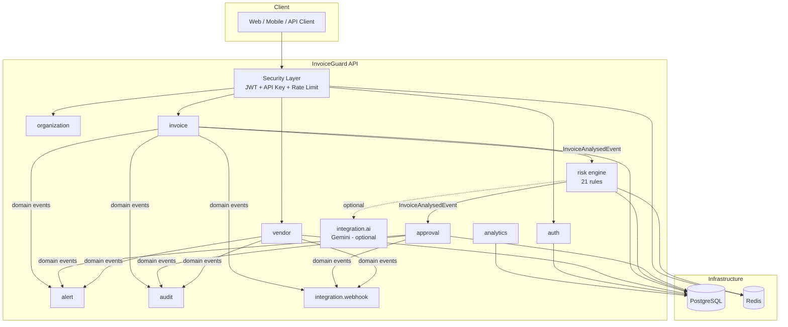
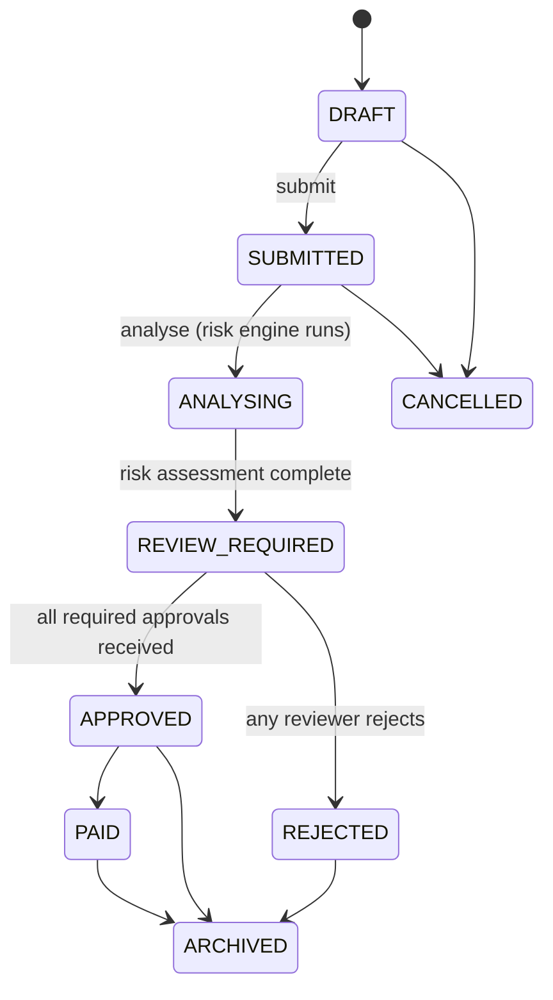

# InvoiceGuard API

InvoiceGuard is a secure backend application that helps businesses spot risky invoices **before money is paid**. It checks for duplicate invoices, unusual amounts, unverified vendors, changed bank details, missing purchase orders, tax mismatches, and other signs of possible fraud.

It is built as a realistic portfolio project: a business can create an organisation, add vendors and invoices, run a risk check, and follow an approval process before an invoice is paid.

**Live API health check:** [invoiceguard-api-e477.onrender.com/actuator/health/liveness](https://invoiceguard-api-e477.onrender.com/actuator/health/liveness)
**Interactive API demo (Swagger):** [Open Swagger UI](https://invoiceguard-api-e477.onrender.com/swagger-ui.html)

---

## Why this project matters

Invoice fraud often looks ordinary at first: a familiar vendor sends a duplicate bill, a bank account is quietly changed, or an invoice amount is slightly higher than usual. By the time a suspicious payment is discovered, it can be difficult or impossible to recover.

InvoiceGuard focuses on prevention. Instead of only recording what happened after a payment, it gives reviewers useful warnings and a clear approval trail before payment is approved.

## What InvoiceGuard can do

- Keeps each organisation's data separate, so one company's users cannot access another company's invoices.
- Uses JWT login, refresh tokens, API keys, and role-based permissions to protect the API.
- Lets teams manage vendors, verify them, and require approval before bank-account details change.
- Creates and searches invoices safely, including duplicate-request protection and financial checks such as `subtotal + tax − discount = total`.
- Runs an explainable **21-rule risk engine** for exact and near duplicates, unusual amounts, vendor trust signals, and suspicious patterns.
- Supports optional Gemini AI summaries. AI explains risk in plain language, but it never makes an approval decision.
- Supports multi-level approvals, alerts, audit history, signed webhooks, rate limiting, caching, and analytics.

## How it is organised

InvoiceGuard is one Spring Boot application, split into focused modules such as authentication, vendors, invoices, risk checks, approvals, alerts, and analytics. This keeps it simple to deploy while keeping the code organised as the project grows. Modules communicate through Spring application events where that makes sense, instead of being tightly coupled.



### Invoice lifecycle



For a deeper explanation of the design decisions, see [`docs/ARCHITECTURE_PHASE_1_2.md`](docs/). It covers the base classes, JWT lifecycle, and tenant-isolation approach.

## Technology stack

Java 21 · Spring Boot 3.3 · Spring Data JPA / Hibernate · Spring Security · PostgreSQL · Redis · Flyway · MapStruct · Lombok · JJWT · springdoc-openapi (Swagger) · JUnit 5 · Mockito · Testcontainers · Docker · GitHub Actions

## Module structure

```
com.invoiceguard
├── auth            Registration, login, JWT/refresh tokens, password reset, email verification
├── organization    Organizations, membership, roles
├── user            User profile
├── vendor          Vendor CRUD, bank accounts, bank-change-request workflow
├── invoice         Invoice CRUD, line items, search, idempotency, documents
├── risk            21-rule risk engine, duplicate detection, vendor statistics
├── approval        Approval policies, requests, steps, actions
├── alert           In-app alerts (event-driven)
├── audit           Immutable audit trail (event-driven)
├── analytics       Aggregate reporting (raw SQL)
├── integration
│   ├── ai          RiskExplanationService (rule-based + optional Gemini), 3 more AI-ready interfaces
│   ├── apikey      Machine-to-machine credentials
│   ├── storage     DocumentStorageService (local disk today, S3/Blob/GCS-ready)
│   └── webhook     Signed, retried outbound event delivery
├── security        JWT, RBAC, tenant isolation, rate limiting, encryption
├── exception       Central error taxonomy and global exception handler
├── config          Security, CORS, Redis, OpenAPI, correlation IDs, seed data
└── common          Base entities, response envelopes, shared enums/utilities
```

## Database overview

6 Flyway migrations, applied in order:

| Migration | Tables |
|---|---|
| V1 | `organizations`, `users`, `organization_members`, `refresh_tokens`, `password_reset_tokens`, `email_verification_tokens` |
| V2 | `vendors`, `vendor_bank_accounts`, `bank_change_requests` |
| V3 | `invoices`, `invoice_items`, `invoice_status_history`, `invoice_documents`, `idempotency_records` |
| V4 | `risk_assessments`, `risk_findings`, `risk_rule_configurations` |
| V5 | `approval_policies`, `approval_requests`, `approval_steps`, `approval_actions`, `alerts`, `audit_events` |
| V6 | `api_keys`, `webhook_subscriptions`, `webhook_delivery_attempts` |

Every organisation-scoped table carries an indexed `organization_id` column (the tenant-isolation backbone) plus the standard audit columns (`version`, `created_at`, `updated_at`, `created_by`, `updated_by`, `deleted`). Hibernate's `ddl-auto` is `validate` in every profile — Flyway migrations are the *only* source of schema truth.

## What you need to run it locally

- Java 21
- Maven 3.9+ (or use the included wrapper conventions)
- PostgreSQL 16 (or Docker)
- Redis 7 (or Docker)

## Environment variables

See [`.env.example`](.env.example) for the full list. The essentials to get running:

| Variable | Required | Notes |
|---|---|---|
| `DB_URL`, `DB_USERNAME`, `DB_PASSWORD` | Yes | PostgreSQL connection |
| `REDIS_HOST`, `REDIS_PORT` | Yes | Redis connection |
| `JWT_SECRET` | Yes | App refuses to start without it. Generate: `openssl rand -base64 48` |
| `BANK_ACCOUNT_ENCRYPTION_KEY` | Yes | Base64 32-byte AES-256 key. Generate: `openssl rand -base64 32` |
| `AI_INTEGRATION_ENABLED`, `AI_PROVIDER`, `GEMINI_API_KEY` | No | App is fully functional with AI disabled (the default) |

## Run locally without Docker

```bash
# 1. Start Postgres and Redis however you prefer, then:
export DB_URL=jdbc:postgresql://localhost:5432/invoiceguard
export DB_USERNAME=invoiceguard
export DB_PASSWORD=invoiceguard
export REDIS_HOST=localhost
export REDIS_PORT=6379
export JWT_SECRET=$(openssl rand -base64 48)
export BANK_ACCOUNT_ENCRYPTION_KEY=$(openssl rand -base64 32)

# 2. Run with the dev profile (enables seed data, verbose SQL logs)
mvn spring-boot:run -Dspring-boot.run.profiles=dev
```

The app starts on `http://localhost:8080`. Swagger UI is at `http://localhost:8080/swagger-ui.html`.

## Run with Docker

```bash
# Production-like stack
cp .env.example .env    # fill in JWT_SECRET and BANK_ACCOUNT_ENCRYPTION_KEY at minimum
docker compose up --build

# Dev mode (seed data, dev profile, throwaway secrets pre-filled)
docker compose -f docker-compose.yml -f docker-compose.dev.yml up --build
```

## Demo users and data

When run with `invoiceguard.seed.enabled=true` (the `dev` profile default), the app creates one demo organisation with three users, all password `Demo1234!`:

| Email | Role |
|---|---|
| `admin@demo.invoiceguard.io` | ORGANIZATION_ADMIN |
| `analyst@demo.invoiceguard.io` | ANALYST |
| `reviewer@demo.invoiceguard.io` | REVIEWER |

The app also creates two vendors (one verified and one unverified) and four invoices in `SUBMITTED` status. One pair is intentionally duplicated, so you can call `POST /invoices/{id}/analyse` and show the risk engine finding the issue during a demo.

## Try the API

```bash
# Register (creates org + admin user, returns tokens directly)
curl -X POST http://localhost:8080/api/v1/auth/register \
  -H "Content-Type: application/json" \
  -d '{"organizationName":"Acme Corp","email":"admin@acme.example.com","password":"SuperSecret123","firstName":"Ada","lastName":"Admin"}'

# Create an invoice, idempotently
curl -X POST http://localhost:8080/api/v1/invoices \
  -H "Authorization: Bearer $ACCESS_TOKEN" \
  -H "Content-Type: application/json" \
  -H "Idempotency-Key: $(uuidgen)" \
  -d '{"invoiceNumber":"INV-1001","vendorId":"'$VENDOR_ID'","invoiceDate":"2026-06-01","currency":"USD","subtotal":"1000.00","taxAmount":"90.00","totalAmount":"1090.00"}'

# Run the risk engine
curl -X POST http://localhost:8080/api/v1/invoices/$INVOICE_ID/analyse -H "Authorization: Bearer $ACCESS_TOKEN"
```

A full [Postman collection](postman/InvoiceGuard.postman_collection.json) covering every module is included.

## Testing the project

```bash
mvn test                                    # everything
mvn test -Dtest='!**/*IntegrationTest'      # unit tests only (fast, no Docker needed)
mvn test -Dtest='**/*IntegrationTest'       # integration tests (needs Docker for Testcontainers)
```

- **Unit tests**: invoice-number normalization, string similarity, duplicate detection, vendor statistics (mean/median/stddev), individual risk rules, tax/total validation, invoice/vendor state-transition rules, approval-policy resolution, idempotency hashing, JWT issuance/validation/blacklisting, and role-permission mappings.
- **Integration tests** (Testcontainers — real PostgreSQL + Redis, not H2): full auth lifecycle (register → login → protected endpoint → refresh → logout-revokes-token), cross-tenant data isolation, and invoice idempotency-key replay/conflict behavior.

## Security choices

- Passwords: BCrypt. Refresh tokens, password-reset tokens, email-verification tokens, and API keys: SHA-256 hashed, opaque, shown once at issuance.
- Bank account numbers: AES-256-GCM encrypted at rest; API responses only ever show a masked value.
- JWT access tokens are short-lived (15 min default); logout blacklists the specific token in Redis rather than waiting for natural expiry.
- Account lockout after repeated failed logins; tenant isolation enforced at both the service layer (`TenantContext`) and query layer (every `Specification` filters on `organizationId`).
- Rate limiting fails open (Redis outage never blocks the whole API); caching fails open the same way.
- No stack traces are ever returned to API clients — every error is the standard `{success:false, code, message, ...}` shape.

## Future improvements

- Full OCR-based document extraction (`InvoiceDocumentExtractionService` interface exists, no implementation yet)
- Per-API-key rate limit enforcement (column exists, not yet wired into the limiter)
- Cancel/escalate/delegate/resubmit approval actions beyond submit/approve/reject
- Multi-organisation "switch active org" endpoint for users belonging to more than one tenant
- Encrypt webhook signing secrets at rest

## License

Apache 2.0

## Created by

**Manas Surayavnshi**
